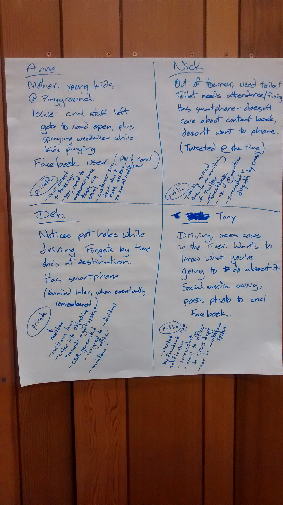

# Team 1: Easy to use reporting of asset issues

## Defining the problems
Reports come from:
 * Social media (Facebook, twitter) - council pages and private messages
 * Phone
 * Web form

Issues with internal processes to handle the reports via social media

The issue is taken from social media and into a request system?

What data is needed?

Would council implement solutions?

Need to close the loop
 * Acknowledge the receipt of the request
 * Updates on actions
 * Resolution of request

Can we monitor other forums?

Monthly reporting of requests

## Personas

## Solution concept at demo

