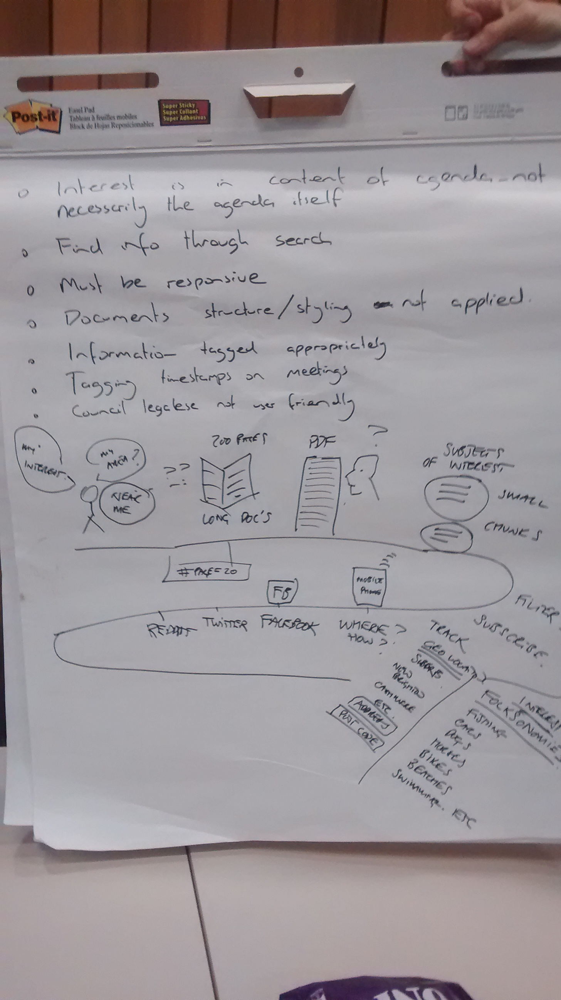
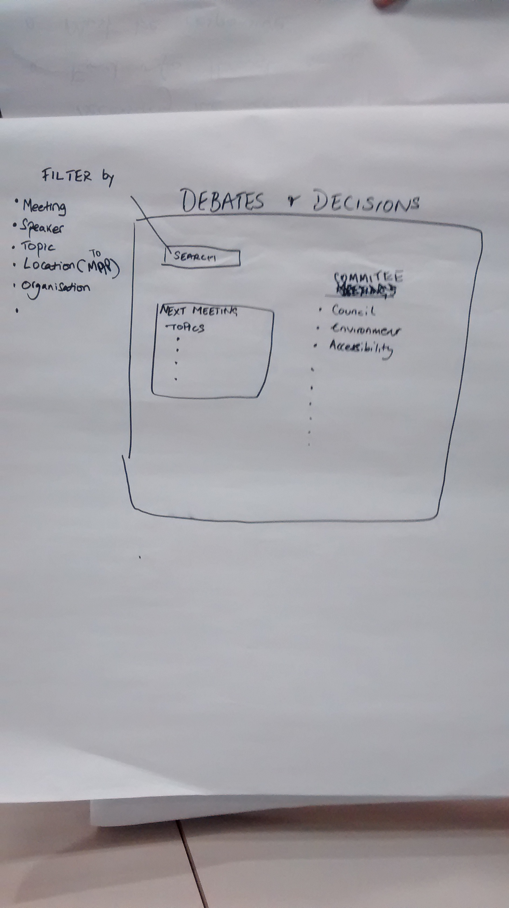
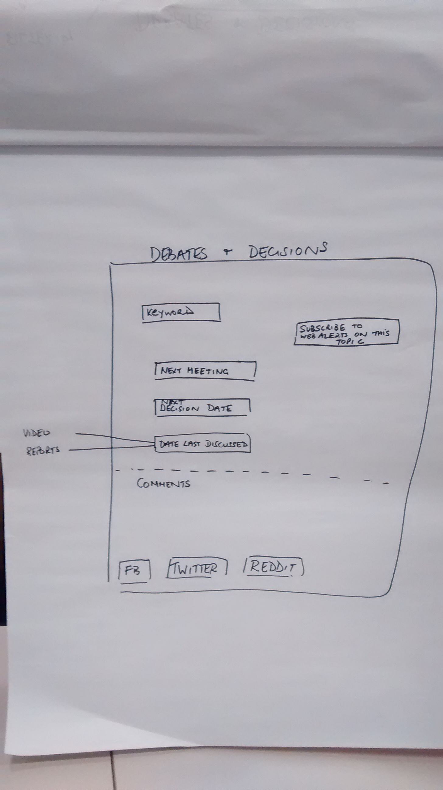

# Team 3: More useful minutes and agendas

## Background
* Users' interest is in the content of the agenda - not necessarily the agenda itself, which can be 200+ pages.
* Find info through search
* Must be responsive
* Document structure/styling not applied
* Information tagged appropriately
* Tagging timestamps on audio/video
* Council legalese not user friendly
* Hashtag subscription to issue-focused updates
* High level result, drill down to details (which way councillors voted), debate video /audio, transcript, issue timeline (eg. storify).
* Tagging segments of content inside source document (assumed to be PDF for this exercise).

## Defining the problem

## PDF segmenting/scraping

## Mapping process
Extracting submitters' addresses from last month's agenda into a spreadsheet/fusion table

## UI ideas

