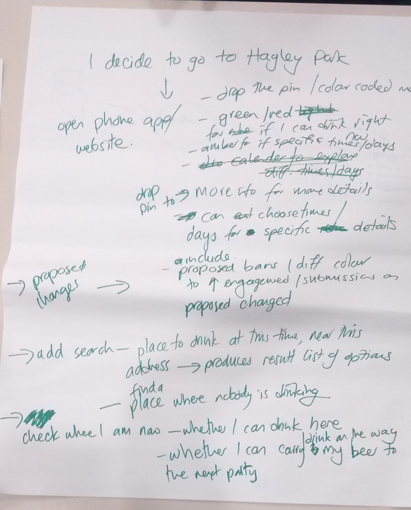
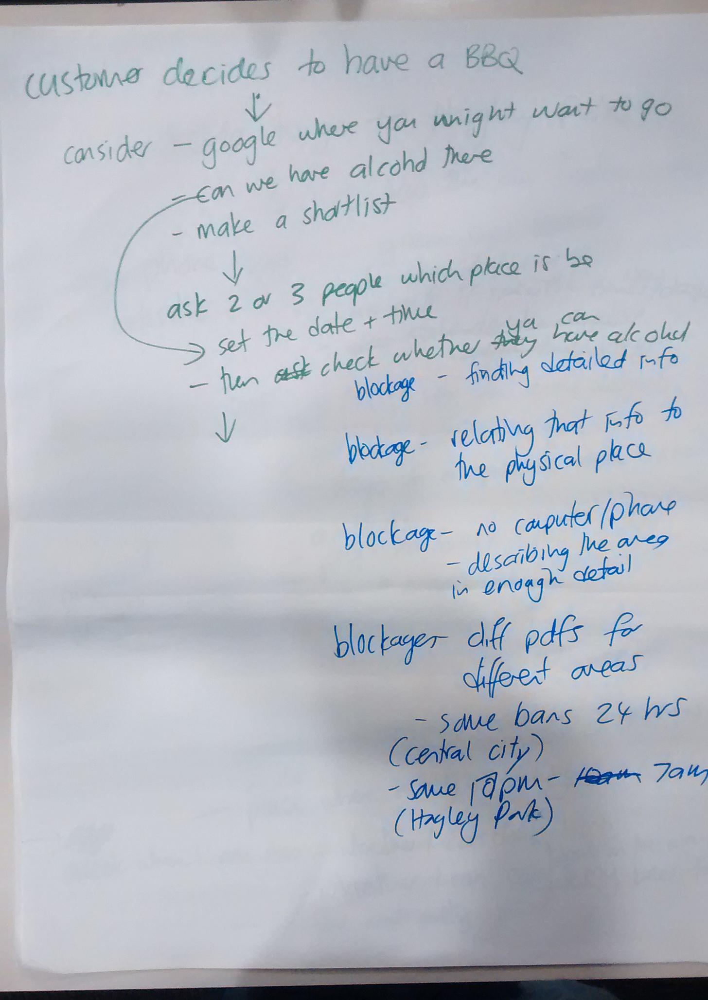

# Team 4: Mapping bylaws

https://wayne-carter-ckei.squarespace.com

The problem of where to have a beer

Bylaws information is complex (eg bylaws for alcohol bans, events, trading in public places, dog walking, planning zones)

If you aren’t a local you might not know where to find that information
 

Bylaw rules are often poorly advertised, or published in isolated maps (eg a map showing the 10pm to 7am liquor ban in Hagley park, but not the adjoining 24 hour central city liquor ban)

It can be difficult to post effective signs and expensive to keep them up to date when bylaws are reviewed.  If you walk in from one end of Hagley Park there is no liquor ban sign, but from the other end there is. No boundary in the middle. 

Images in pdfs and as jpgs on council websites can be difficult to relate to what is actually on the ground. 

There can be different rules depending on the time of day, time of year etc

This information is also reviewed from time to time  and the boundaries for things such as alcohol bans can change. 

People want to access this information from anywhere , theya re on the move and may change direction and destination anytime

From a prosecution point of view you want the information to be as public as possible to everyone knows the rules.  

People expect accurate up to date instant digital information everywhere..

