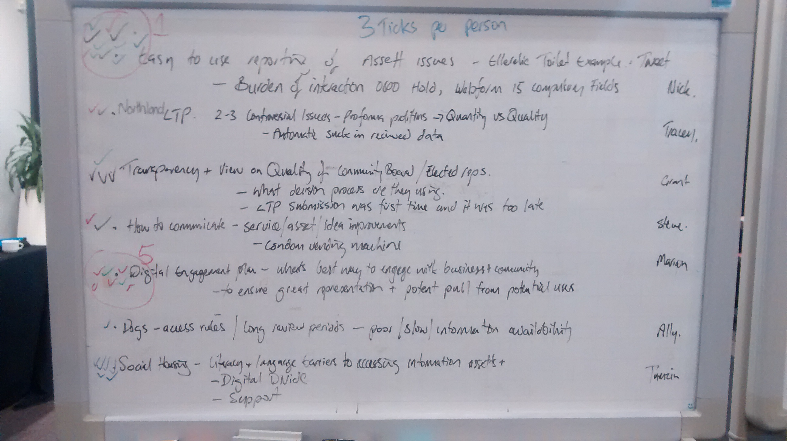
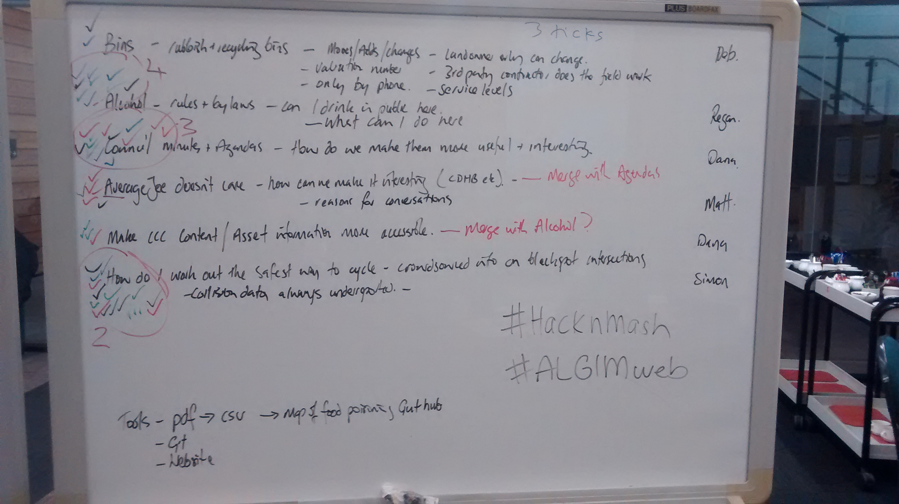

# ALGIM Hack n mash 17 May 2015

## Ideas for problems to solve
We pitched potential problems to solve and then dot voted to find a set of 5 key problems to work on.

### Selected
[Easy to use reporting of asset issues - tweet to report a broken toilet etc Burden of interaction (calling an 0800 number etc). Could we scrape some data from social media?](easy-to-use-reporting-of-asset-issues.md)

[Digital engagement plan - best way to communicate this community and businesses how do we ensure good representation](digital-engagement.md)

[Alcohol - where can I drink? Extended to other things like BBQs, dog walking etc. Mapping local bylaws](mapping-bylaws.md)

[Council and local DHBs minutes and agendas… how do we make them more useful and  interesting](making-minutes-useful.md)

[How do I find out the safe cycle places? Locate black spots, map collision data](safe-cycle-places.md)

### Other problems to solve
Controversial issues Petitions (Quantity vs Quality) - how can we automate the data collection.

Transparency and view of quality of community boards/elected reps. Decision processions? 

How to communicate where condom machines are? (Helping women’s heal initiative).

Dogs! access rules, how to get information in from the region about changes to dog access.

Social housing - literacy and language barriers, can we create tools to help this? Issues with digital divide an support.

Bins - rubbish and recycling, dealing better with moving, adding, changes to bins. Only land owners can change, they need the valuation numbers of the property, a 3rd party does the field work, often only by phone (not digital service).

(Christchurch city council) Make content and asset information more accessible to show what awesome things are here. (Reworking the many pages on the CC site into something more useful.

## Photos of the boards

